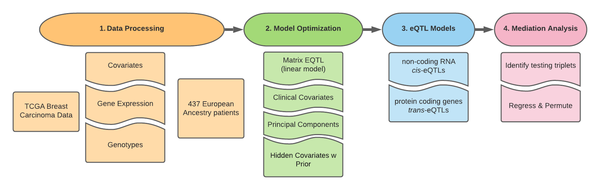
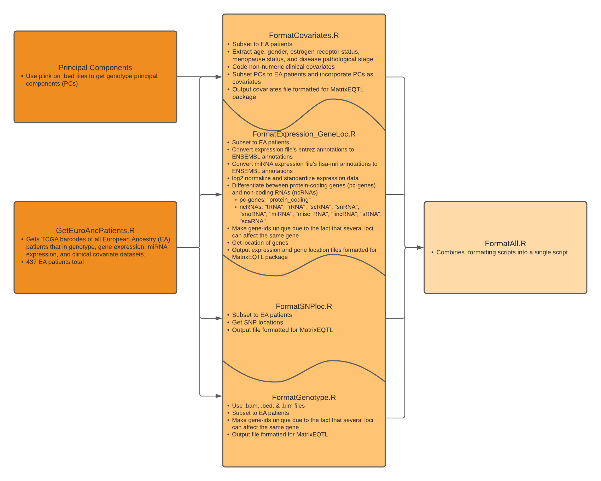
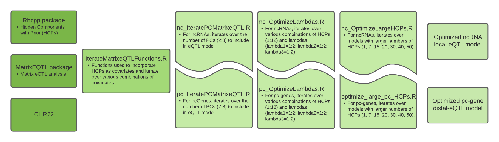
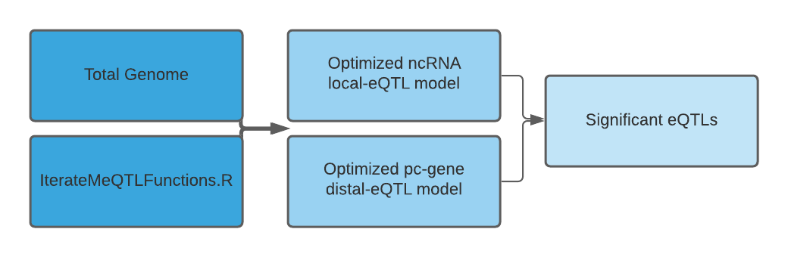
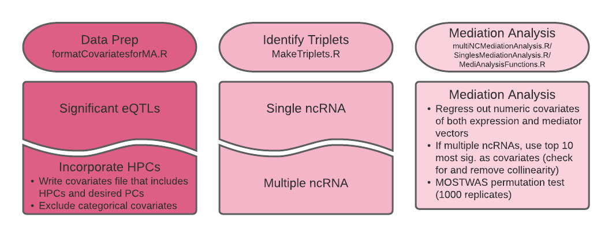

# 0.Workflow

# 1. Data Processing

437 European Ancestry, female patients were included. We included XXX protein-coding genes and XXX non-coding RNAs in the analysis. 
## Table 1: Covariate Codes
| Covariate  | Definition               | Level                                                                                       | Code |
|------------|--------------------------|---------------------------------------------------------------------------------------------|------|
| Age        | Patient age              | Numeric                                                                                     | NA   |
|            |                          |                                                                                             |      |
| Estrogen   | Estrogen Receptor Status | Negative                                                                                    | 0    |
|            |                          | Positive                                                                                    | 1    |
|            |                          | Indeterminate                                                                               | 3    |
|            |                          | NA                                                                                          | 4    |
|            |                          |                                                                                             |      |
| Menopause  | Patient menopause status | pre (<6 mon. since lmp and no prior bilateral ovariaectomy and not on estrogen replacement) | 0    |
|            |                          | peri (6-12 mon. since last menstrual period)                                                | 1    |
|            |                          | post (prior bilateral ovariaectomy or >12 mon. since lmp with no prior hysterectomy         | 2    |
|            |                          | indeterminate (neither neither pre- nor post-menopausal)                                    | 3    |
|            |                          | NA                                                                                          | 4    |
|            |                          |                                                                                             |      |
| Pathologic | Pathological state       | stage i                                                                                     | 0    |
|            |                          | stage ia                                                                                    | 1    |
|            |                          | stage ib                                                                                    | 2    |
|            |                          | stage ii                                                                                    | 3    |
|            |                          | stage iia                                                                                   | 4    |
|            |                          | stage iib                                                                                   | 5    |
|            |                          | stage iii                                                                                   | 6    |
|            |                          | stage iiia                                                                                  | 7    |
|            |                          | stage iiib                                                                                  | 8    |
|            |                          | stage iiic                                                                                  | 9    |
|            |                          | stage iv                                                                                    | 10   |
|            |                          | stage x                                                                                     | 11   |
|            |                          | NA                                                                                          | 12   |

# 2. Model Optimization

## Table 2: Optimized Models
| Gene Type | eQTL | Principal Components (PCs) | HCPs (k) | lambda1 | lambda2 | lambda3 |
| :---: | :---: | :---: | :---: | :---: | :---: | :---: |
|non-coding | local | 4 | 1 | 1 | 1 | 1 |
| protein-coding | distal | 4 | 7 | 1 | 2 | 1 |

# 3. eQTL Models

## Table 3: Results of Optimized Models on Total Genome
| Gene Type | eQTL | Principal Components (PCs) | HCPs (k) | lambda1 | lambda2 | lambda3 | p-value Threshold | # significant |
| :---: | :---: | :---: | :---: | :---: | :---: | :---: | :---: | :---: |
|non-coding | local | 4 | 1 | 1 | 1 | 1 | 1e-6 | 1,298 |
| protein-coding | distal | 4 | 7 | 1 | 2 | 1 | 1e-6 | 3,719,308 |

# 4. Mediation Analysis

## Table 4: Triplets
| Triplet Type   | Count |
|----------------|-------|
| Single ncRNA   | 4,949 |
| Multiple ncRNA | 140   |

# 5. Misc.
Links to flowcharts:

[Flowcharts 0-2](https://lucid.app/lucidchart/invitations/accept/inv_5488efa8-e3f8-402d-8c3f-d2cbc1482340?viewport_loc=-122%2C-173%2C2032%2C1176%2C0_0)

[Flowcharts 3-4](https://lucid.app/lucidchart/invitations/accept/inv_d3d035fa-76e7-4595-958b-276b87a22e97?viewport_loc=-11%2C-11%2C1664%2C1005%2C0_0)
